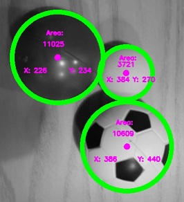
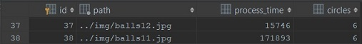

# *opencv-rueppelli-2*

made by Andrea Rapp, Fanni Takacs, Mark Toth and Zsuzsanna Franko

 This is a software being developed by students of **GFA** in the project phase. 

 It is written in *C++* and uses the *openCV* library for picture processing.
 
 It can detect circles on any given picture, we also get the area and the coordinates of the circles.
 We can modify the picture with gaussian or median blur for more accurate detection.
 
 
 
 
 The number of circles detected on a picture and the time in which it was processed are saved into an *SQLite* database.
 
  
 
 
 It has a few sorting functions based on sorting algorithms. Their usage is still being developed.
 
 We unit test the software with *googletest*.

*Our aim is to increase accuracy of image detection and to add useful features during the development.*

<h2> INSTALLATION AND SETUP </h2>

 Things you will need:

 - [Visual Studio 2017](https://visualstudio.microsoft.com/downloads/)
 - [CMake](https://github.com/Kitware/CMake/releases/download/v3.14.0-rc1/cmake-3.14.0-rc1-win64-x64.msi)
 - [VCPKG](https://github.com/Microsoft/vcpkg)
 - [OpenCV 4.0.1](https://drive.google.com/open?id=11OIT6GlLsg0z8G8tLzs674nv5BZdKgfq)
 
 - Intall Visual Studio 2017 and the Microsoft Visual c++ toolset with the installer.
 - Install CMake and add it to your PATH environment variable.
 - Start the InstallOCV.sh, it will automatically download the latest version of OpenCV with the extra modules and builds the binaries for you.
 - Create the OPENCV_DIR environment variable and set it to the vc15 folder. (%the folder where installOCV.sh is located%\install\x64\vc15)
 - In Visual Studio, on the property pages of your project set the following properties: C++ -> General -> Additional include libraries -> `$(OPENCV_DIR)\..\..\include`, Linker -> General -> Additional library directories -> `$(OPENCV_DIR)\lib`, Linker -> Input -> Additional Dependencies ->  `opencv_world401d.lib;opencv_world401.lib;ws2_32.lib;`
 - Clone the VCPKG repo and follow the instructions to install it. (`bootstrap-vcpkg.bat` and `vcpkg integrate install`)
 - Install Sqlite3, gtest and Tesseract with the following command with VCPKG: `vcpkg install sqlite3:x64-windows`, `vcpkg install tesseract:x64-windows` and `vcpkg install gtest:x64-windows`
 - Known issue: on some machines, Visual Studio can't find the `opencv-world401.dll`, in that case, copy the file from the OpenCV install folder to the folder of the built executable
 
 Enjoy!
 