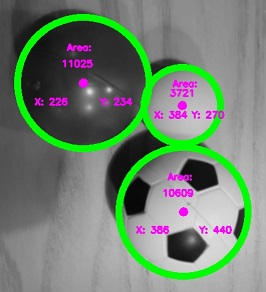
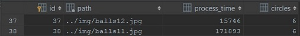

# *opencv-rueppelli-2*

 This is a software being developed by students of **GFA** in the project phase. 

 It is written in *C++* and uses the *openCV* library for picture processing.
 
 It can detect circles on any given picture, we also get the area and the coordinates of the circles.
 We can modify the picture with gaussian or median blur for more accurate detection.
 
 
 
 
 The number of circles detected on a picture and the time in which it was processed are saved into an *SQLite* database.
 
  
 
 
 It has a few sorting functions based on sorting algorithms. Their usage is still being developed.
 
 We unit test the software with *googletest*.

*Our aim is to increase accuracy of image detection and to add useful features during the development.*